# RVC computing nest rapid deployment

## Overview

RVC sound cloning technology (Retrieval-based-Voice-Conversion-WebUI) is a sound synthesis technology based on deep learning. The core principle is to learn and match the input speech sample with the speech characteristics of the target speaker through deep learning model training. This model is then used to speech synthesize the new text so that the synthesized speech sounds just like the target speaker.

## Billing Description

| Resource Type | Billing Mode | Key Configurations |
| -------- | ------ | -------------------------------------------- |
| ACS Cluster | Pay-As-You-Go | Billing is based on the selected GPU type and quantity. GU8TF/GU8TEF/P16EN specifications vary in price. |
| OSS Storage | Pay-As-You-Go | The storage model file. We recommend that you select the storage type in the same region as the cluster. |
| NAT Gateway | Pay-As-You-Go | Automatically created when Internet access is enabled. Billing is based on usage time and bandwidth |

## Required Permissions for RAM Users

To deploy an instance, you need to access and create some Alibaba Cloud resources. Therefore, your account must contain permissions for the following resources. And you need to activate the ACS service. After activation, you can see the following in the upper right corner of the ACS console:
**Activate Status: GPU Pay-As-You-Go has been activated, GPU capacity reservation has been activated, and CPU Pay-As-You-Go has been activated**.

| Permission policy name | Comment |
|---------------------------------|----------------------------|
| AliyunVPCFullAccess | Permissions to manage a VPC |
| AliyunROSFullAccess | Manage permissions for Resource Orchestration Service (ROS) |
| AliyunCSFullAccess | Manage permissions for Container Service (CS) |
| AliyunComputeNestUserFullAccess | Manage user-side permissions for the compute nest service (ComputeNest) |
| AliyunOSSFullAccess | Permissions to manage Network Object Storage Service (OSS) |

In addition, * * need to contact PDSA to add GPU whitelist before deployment.**

## Deployment process
1. Enter the service deployment page through the calculation nest [Quick Deployment Link](https://computenest.console.aliyun.com/service/instance/create/cn-hangzhou?type=user&ServiceId=service-5b5e847e82d34c6eae4b).

2. By submitting a work order, let customer service open the white list of P16EN instances before the next deployment.

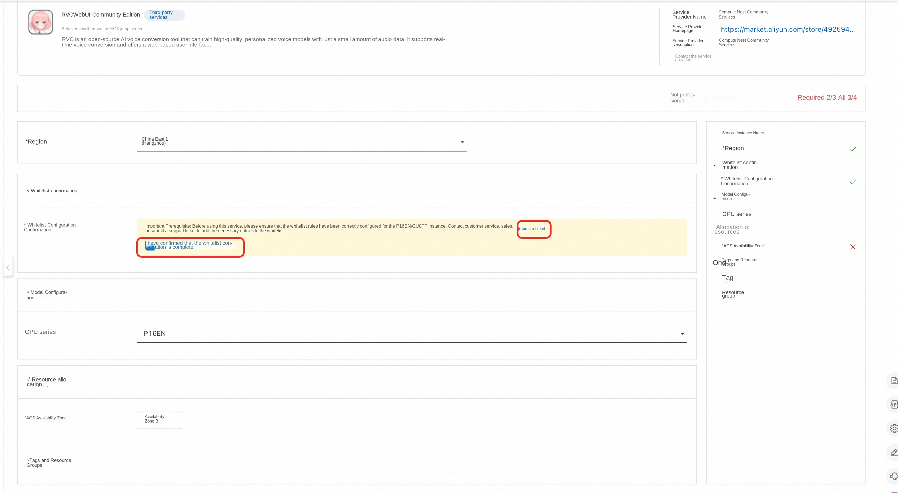

3. GPU series currently only has P16EN, so there is no need to select it. After selecting ACS available area, click "Next Confirm Order".

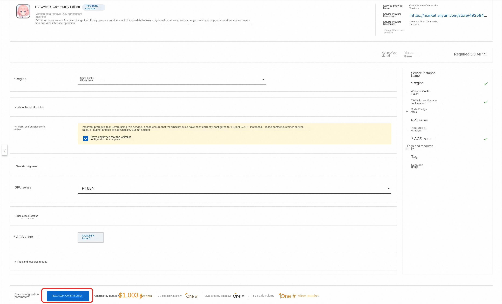

4. Then click Create Now to enter the deployment process of the service instance.

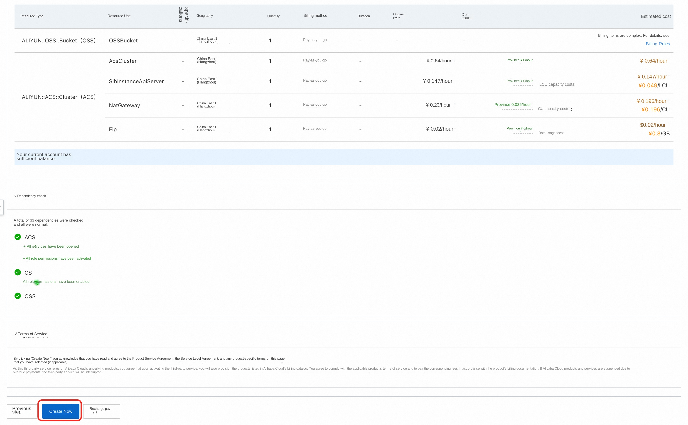

5. After the deployment is complete, click View Service Instance to view the public network address of the RVC service.

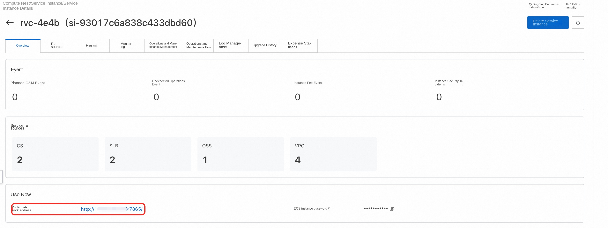

## Usage Tutorial
The use of RVC should first use the prepared voice sound source for training, training to obtain the corresponding model, and then reasoning on the specified sound source, you can change the specified sound source into the training voice, to achieve the effect of sound change.
### Training Tutorial
1. Click the public network address in the service instance details to enter the RVC Web page, and first enter the training page.

2. The training-related configuration should be carried out first, mainly setting the experiment name and training folder. Note that the folder here is the corresponding directory in the container pod, as shown below.

3. Upload the voice samples to be trained to the training folder we set up above. The specific process is given below.
-In the computing nest service instance, click Resources, then click Container Pod Resources to find the pod corresponding to rvc, and click Remote Connection.

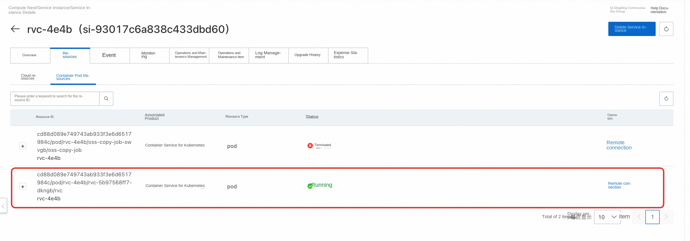

-After clicking Remote Connection, you can enter the pod and create a train directory under the pod internal/workspace/rvc-git directory as the training folder.

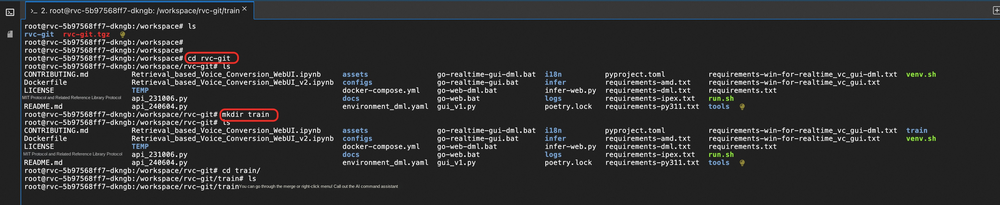

-Upload the prepared voice samples to the train directory. Click the file on the console to open the file tree, and then find the train directory to upload the prepared voice samples.

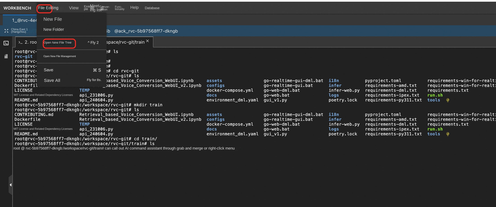

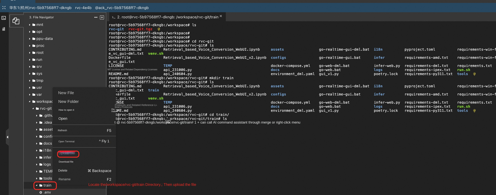

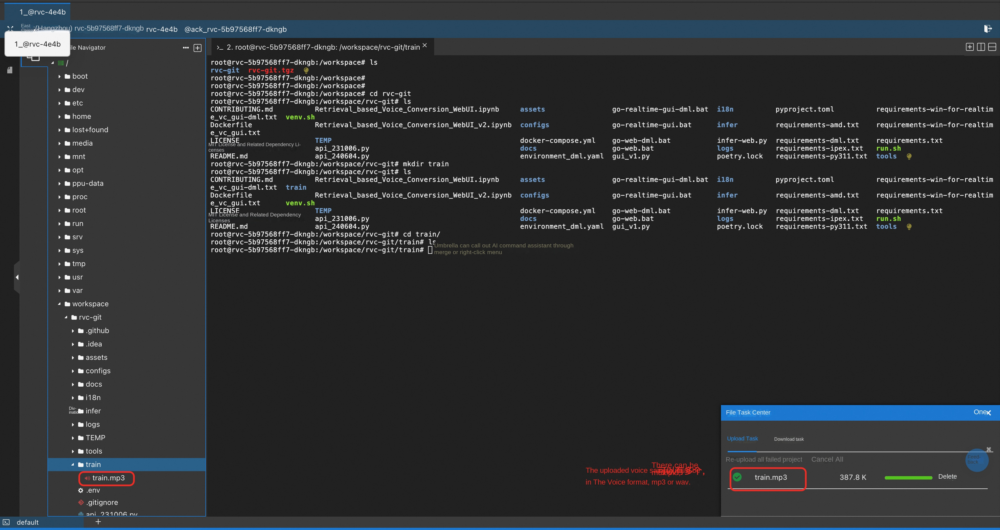
4. After the voice sample is uploaded, the training can be started. First, data processing is carried out. Click "Processing Data" for data processing. The output information will prompt the processing progress.

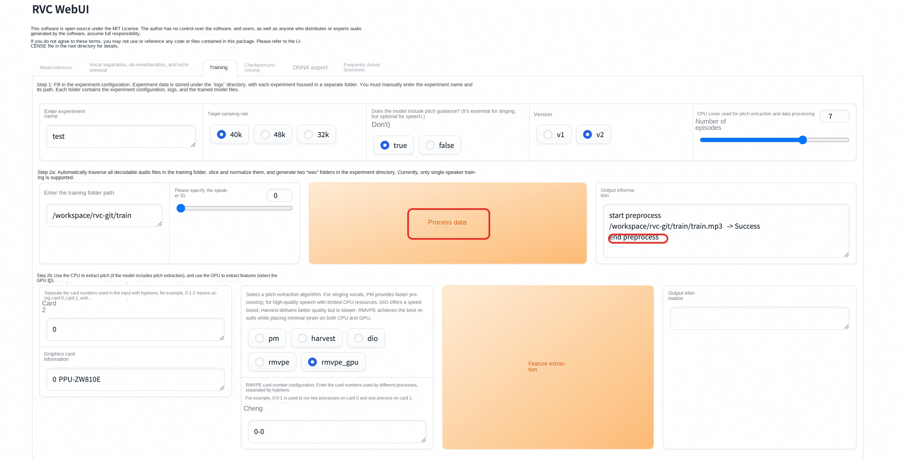

5. Click "Feature Extraction" to extract features, and the output information will prompt the progress of feature extraction.

6. Click "Training Model" to train the model. Error will be prompted here, but it is actually a false alarm. The training is still going on normally,
You can run the tail -f /var/logs/app.log command in the pod in step 3 to view the training progress.

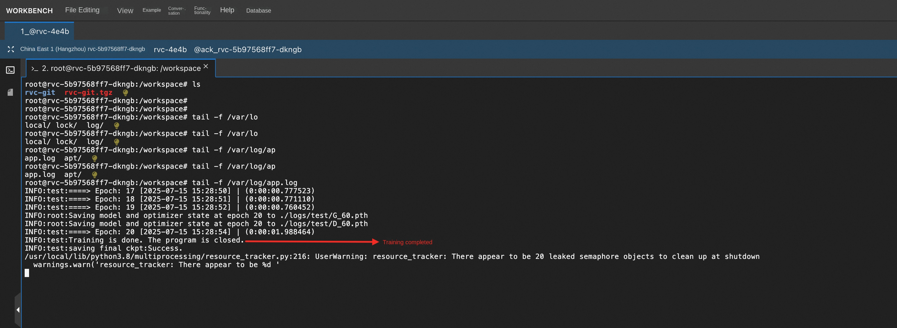

7. After the training is completed, click "Training Feature Index" and see that the index has been successfully constructed, that is, the training has been successful.

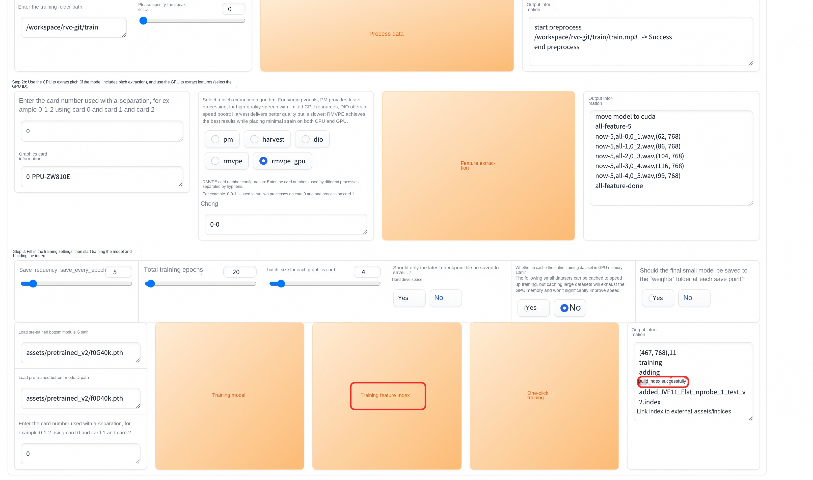

### Reasoning tutorial
After the training is completed, we can reason about the voice we want to change. The specific steps are as follows:
1. The RVC web page returns to the model inference page and clicks "Refresh Tone List and Index Path" to load the model that has just been trained.

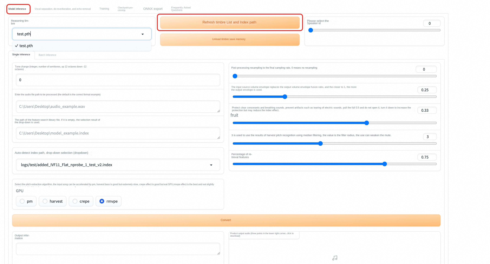

2. Select the model we have just trained and set the path of the audio file to be processed. It should be noted here that the path corresponding to a single inference needs to go to the file name,
Multiple inference settings can be set to the directory, here we set the path of the audio to be processed, the same as the training process, the file must be uploaded to the pod container, see
Step 3 in the training process.

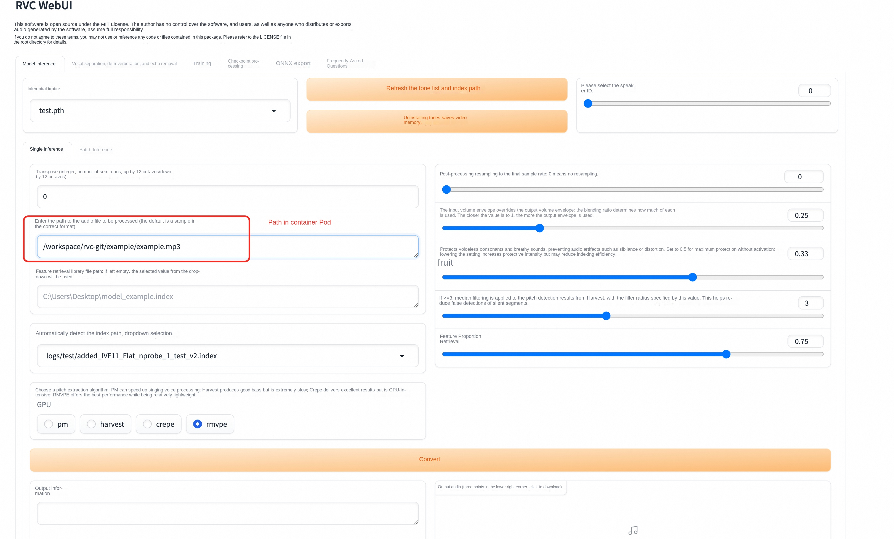

3. Click Convert, and the audio to be processed will be changed. After the sound change is completed, the output audio will have corresponding audio, which can be played directly or downloaded.
This process may fail, and you can try again after the failure.

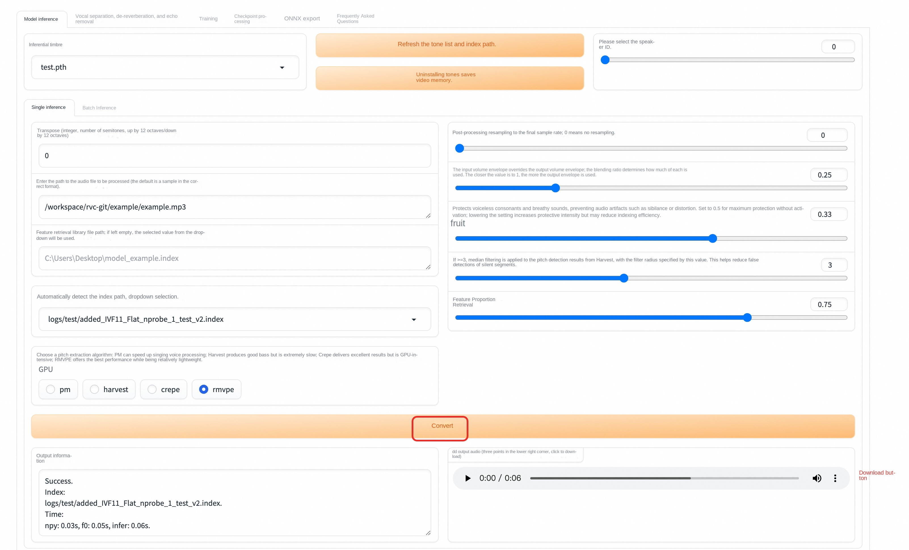