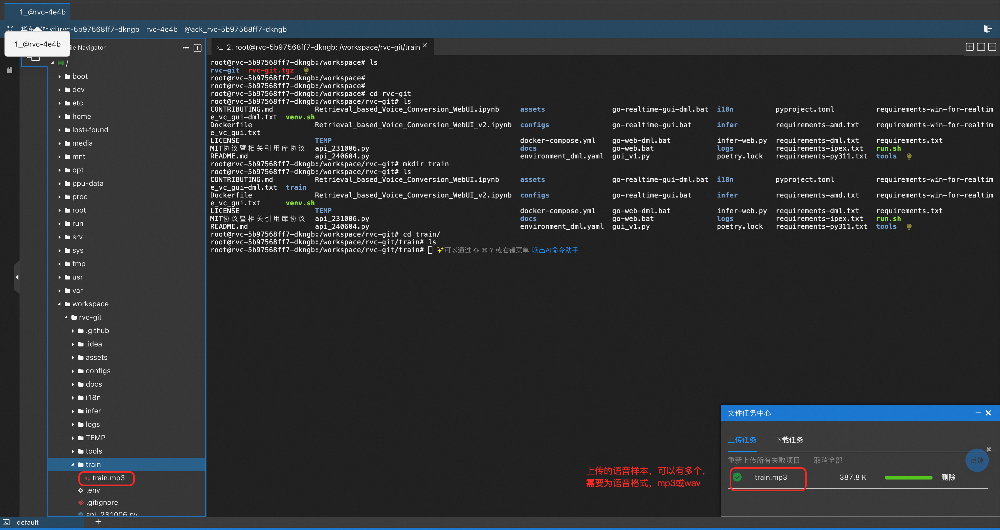
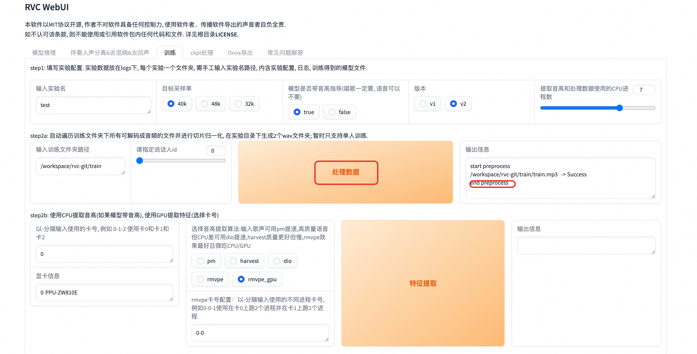

# RVC计算巢快速部署

## 概述

RVC声音克隆技术（Retrieval-based-Voice-Conversion-WebUI）是一种基于深度学习的声音合成技术。 其核心原理在于通过深度学习模型训练，将输入的语音样本与目标说话者的语音特征进行学习和匹配。 随后，利用这个模型对新的文本进行语音合成，使得合成的语音听起来就像目标说话者一样。

## 计费说明

| 资源类型   | 计费模式 | 关键配置说明                                     |
|--------|------|--------------------------------------------|
| ACS集群  | 按量付费 | 根据所选GPU类型和数量计费，GU8TF/GU8TEF/P16EN规格不同价格不同      |
| OSS存储  | 按量付费 | 存储模型文件，建议选择与集群同地域的存储类型                     |
| NAT网关  | 按量付费 | 当开启公网访问时自动创建，按使用时长和带宽计费                    |

## RAM账号所需权限

部署实例需要对部分阿里云资源进行访问和创建操作。因此您的账号需要包含如下资源的权限。且需要开通ACS服务，开通后可以在ACS控制台右上角看到：
**开通状态：GPU 按量付费已开通, GPU 容量预留已开通, CPU 按量付费已开通**。

| 权限策略名称                          | 备注                         |
|---------------------------------|----------------------------|
| AliyunVPCFullAccess             | 管理专有网络（VPC）的权限             |
| AliyunROSFullAccess             | 管理资源编排服务（ROS）的权限           |
| AliyunCSFullAccess              | 管理容器服务（CS）的权限              |
| AliyunComputeNestUserFullAccess | 管理计算巢服务（ComputeNest）的用户侧权限 |
| AliyunOSSFullAccess             | 管理网络对象存储服务（OSS）的权限         |

除此之外，**部署前需要联系PDSA添加GPU白名单。**

## 部署流程
1. 通过计算巢[快速部署链接](https://computenest.console.aliyun.com/service/instance/create/cn-hangzhou?type=user&ServiceId=service-5b5e847e82d34c6eae4b)进入到服务部署页面。

2. 通过提交工单，让客服给开通P16EN实例的白名单，才可进行下一步部署。

3. GPU系列目前只有P16EN，不用进行选择，选择ACS可用区后，点击《下一步确认订单》。

4. 然后点击立即创建，就会进入服务实例的部署流程中。

5. 部署完成后，点击查看服务实例，可以看到RVC服务的公网地址。

## 使用教程
RVC的使用要先用准备好的语音声源进行训练，训练获取对应的模型后，再对指定声源进行推理，就可以将指定声源变声为训练所用的语声，达到变声的效果。
### 训练教程
1. 点击服务实例详情中的公网地址，即可进入到RVC Web页面，首先进到训练页面。

2. 这里先要进行训练相关的配置，主要要设置实验名称，训练文件夹，注意这里的文件夹为容器Pod里对应的目录，具体如下所示。

3. 将要训练的语音样本上传到我们上面设置的训练文件夹中，下面给出具体过程。
    - 在计算巢服务实例中，点击《资源》，然后点击《容器Pod资源》，可以找到rvc对应的Pod，点击《远程连接》。
      
    
    
    - 点击《远程连接》后，可以进到Pod内部，在Pod内部/workspace/rvc-git目录下创建一个train目录，作为训练文件夹。

    

    - 将准备好的语音样本上传到train目录中，这里先点击控制台上的文件打开文件树，然后找到train目录，就可以把事先准备好的语音样本进行上传了。
   
    
    
    
   
    
4. 语音样本上传完成后，就可以开始进行训练了，首先进行数据处理，点击《处理数据》进行数据处理，输出信息会提示处理进度。

5. 点击《特征提取》进行特征提取，输出信息会提示特征提取进度。

6. 点击《训练模型》进行模型训练，这里会提示Error，但实际上是误报，训练还是在正常进行，
训练进度可以在步骤3中的Pod中执行 tail -f /var/logs/app.log 命令查看训练进度。

7. 训练完成后，点击《训练特征索引》，看到成功构建索引，就是训练成功了。

### 推理教程
训练完成后，我们就可以对我们想要变声的语音进行推理了，具体步骤如下：
1. RVC web页面回到模型推理页面，点击《刷新音色列表和索引路径》，去加载刚才训练完成的模型。

2. 选择我们刚训练好的模型，设置待处理音频文件路径，这里需要注意的是，单次推理对应的路径要到文件名称，
多次推理设置到目录即可，这里我们设置待处理音频的路径，和训练过程一样，文件要先上传到Pod容器中，具体见
训练过程中的步骤3。

3. 点击转换，就会开始将待处理的音频进行变声，变声完成后，输出音频会有对应的音频，可以直接播放，也可以进行下载。
这个过程可能会失败，失败后重试即可。

